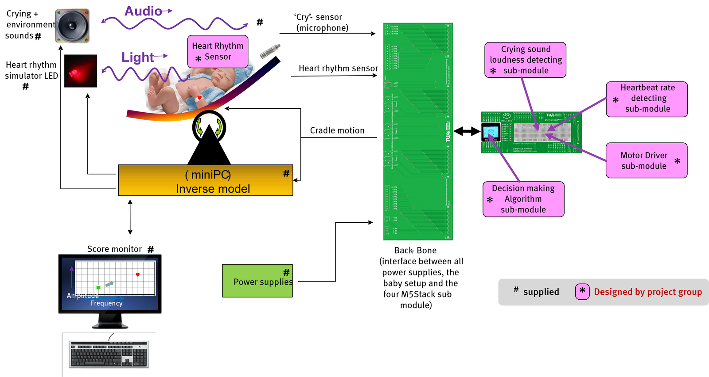
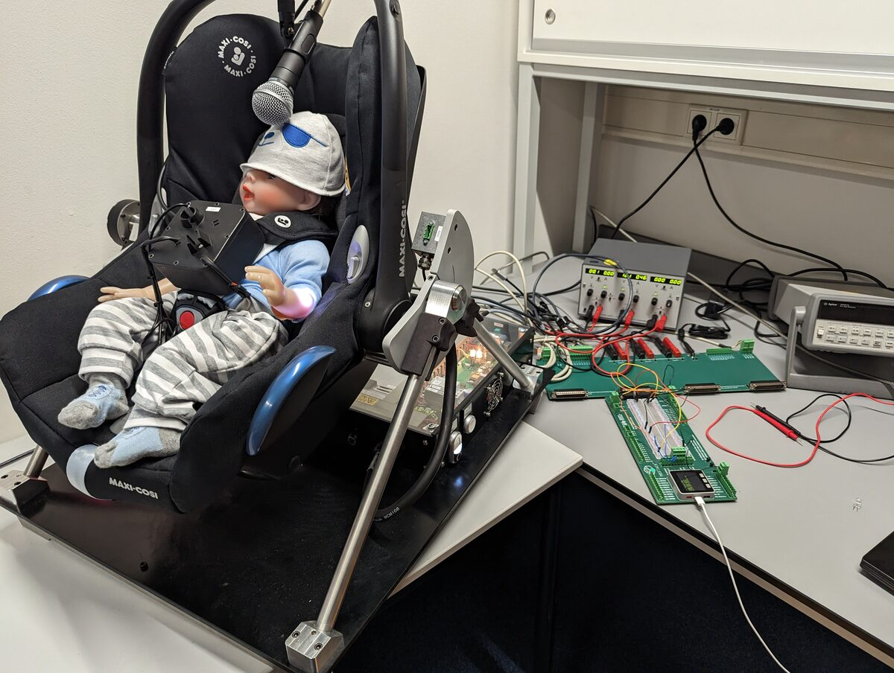

# Rock Your Baby

A robotic cradle that soothes a crying baby on its own, built for a TU/e Electrical Engineering design project (Team 25). A baby simulator sits in a rocking cradle and expresses its stress through two signals: crying sound and heart rate. The system senses both, rocks the cradle with a motor, and searches for the rocking motion that calms the baby fastest. In the 2023 course competition this algorithm won the Fastest Algorithm category with a time of 01:42.

<p align="center">
  
</p>

## How it works

The setup is split into four sub-modules, each running on its own M5Stack (ESP32), connected through a custom Backbone interface board that ties together the power supplies, the baby setup, and the modules.

- Crying detection: a microphone picks up the crying sound. The M5Stack counts signal peaks per second using a rising-edge interrupt, which gives a loudness measure, and compares consecutive one-second windows to judge whether the crying is getting quieter.
- Heartbeat detection: a light-dependent resistor reads a pulsing LED that acts as the baby's heart rhythm. The code times the interval between light changes and converts it to beats per minute. A BPM falling toward roughly 60 means the baby is calming down; around 240 is panic.
- Motor driver: a motor rocks the cradle. The motion is set by two parameters, frequency and amplitude, each with five discrete levels from 5 percent to 80 percent PWM duty cycle, driven on two ESP32 PWM channels. A manual version lets you change frequency and amplitude live with the M5Stack buttons.
- Decision algorithm (inverse model): this is the part that was timed in the competition. It treats the rocking as a point in a 2D frequency-amplitude space and hill-climbs toward the calmest setting. It changes one setting, waits, then checks whether crying or heart rate improved. If the setting made things worse it steps back and tries the other axis, repeating until the baby reaches rest mode.

The score monitor plots the current setting on an amplitude-versus-frequency grid so the search can be followed live.

<p align="center">
  
  <br>
  <em>Physical setup: baby simulator in the rocking cradle, microphone, motor, M5Stack modules and the Backbone board.</em>
</p>

## Repository structure

```
Crying/     microphone peak-counting to measure crying loudness
Heartbeat/  LDR-based heartbeat detection and BPM calculation
Motor/      PWM cradle motor driver, including manual M5Stack button control
Decision/   the inverse-model decision algorithm that combines sensing and drives the motor
```

Each sub-module was built and tested as its own Arduino sketch before being combined in the decision model. The `history/` folders keep the earlier iterations that led to each final version.

## Running it

The sketches are Arduino code for the M5Stack Core (ESP32). Open a sketch in the Arduino IDE with the M5Stack board support and library installed, select the M5Stack-Core-ESP32 board, and upload. `Decision/simple_inverse_model_v2.ino` is the combined controller; the other folders hold the standalone sub-modules.

## Video demo

https://drive.google.com/file/d/1gziotaAQrM-uwN4YMGw3zv35IAcOEnd7/view?usp=share_link

## Technologies

C++ (Arduino), M5Stack / ESP32, PWM motor control, microphone and LDR sensing.
